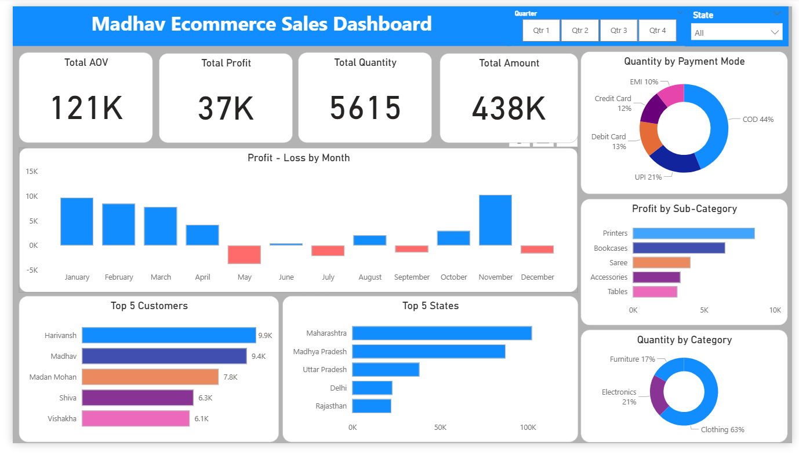

# Online Sales Dashboard – Power BI Project

## Project Objective
Build an interactive dashboard to analyse Madhav Store’s online sales across customers, regions, products, and payment modes, enabling clear performance tracking and actionable business insights.

## Dataset Used: 
- [**Order Details**](https://github.com/radhasiingh/Power-BI-Project-1/blob/main/Details.csv)\
- [Customer details](https://github.com/radhasiingh/Power-BI-Project-1/blob/main/Orders.csv)

## Business Problems

1. What are the total sales, profits, and order volumes?
2. Which states and cities contribute the highest sales and revenue?
3. Which product categories and sub-categories are top performers?
4. How does the monthly profit trend throughout the year?
5. Which payment modes are most commonly used by customers?
6. Who are the top customers based on purchase value?
7. Which sub-categories bring in the most profit?
8. How do different regions perform in terms of sales and profit?
9. Are there specific months with profit dips or losses?
10. Is there a mismatch between order volume and profit contribution?

## Process   
- Verified data quality and structure in Power Query
- Created relationships using Order ID as the key
- Built custom KPIs and visuals using DAX
- Used filters (Quarter, State) to make the dashboard fully interactive

## Conclusion
The Madhav Ecommerce dashboard provides a consolidated view of sales, profit, and customer behaviour, enabling faster data-driven decisions. Key outcomes include identifying high-profit product segments, strong-performing regions, seasonal loss periods, and customer payment preferences. These insights support targeted marketing, inventory optimisation, and improved profitability planning.

## Tools Used
- Microsoft Power BI Desktop
- DAX (Data Analysis Expressions)
- Power Query (for cleaning and transformation)

> **Disclaimer**  
> This project is for learning and portfolio demonstration purposes only and does not represent any firm's business data.
